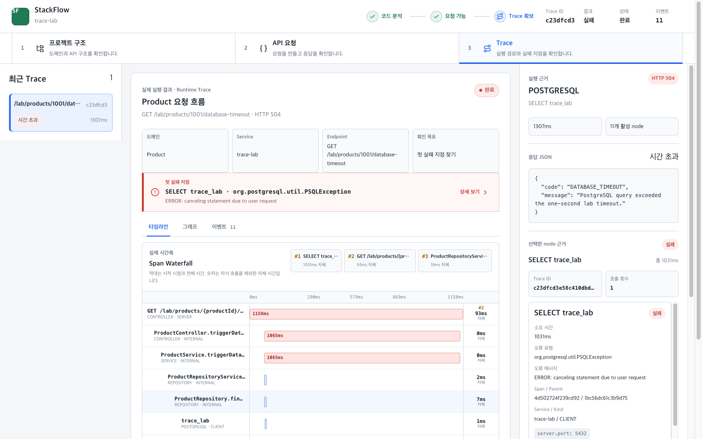
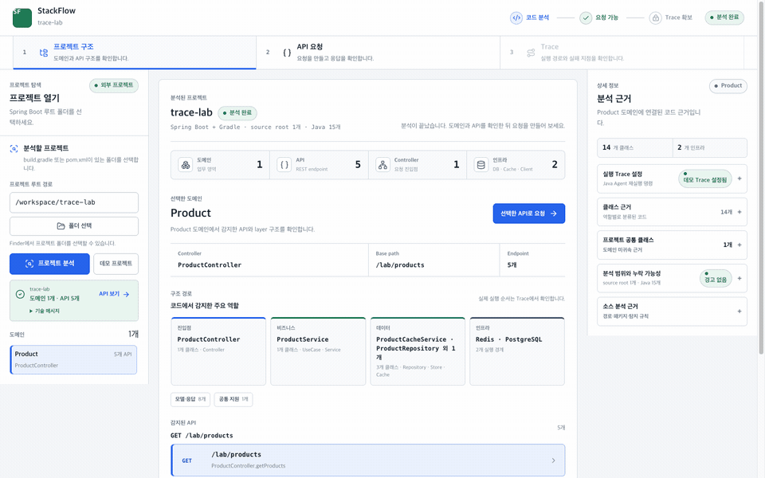
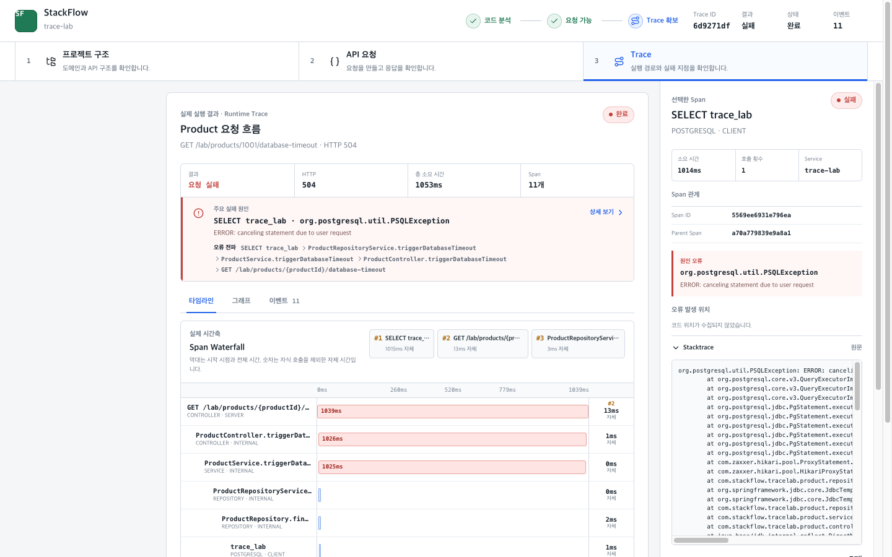
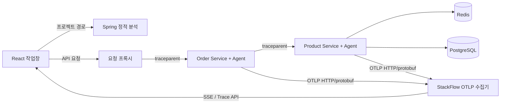
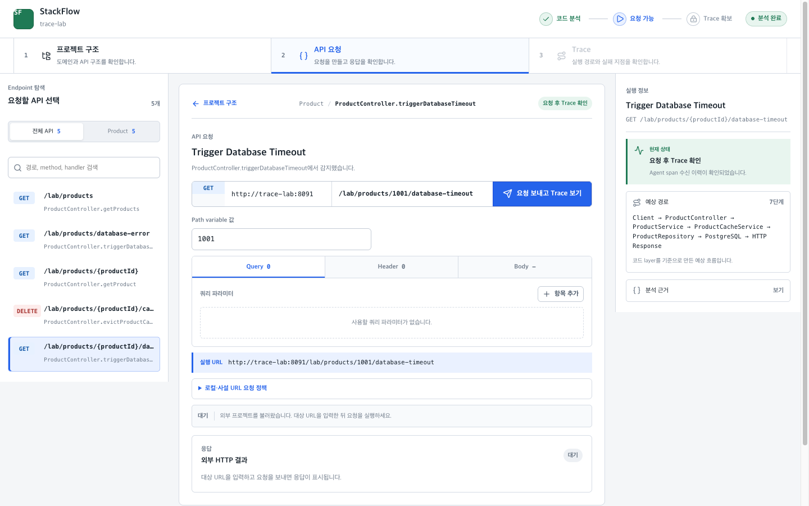

# StackFlow

[](https://github.com/dlwldn30/stackflow/actions/workflows/ci.yml)
[](LICENSE)

**Spring Boot 코드를 분석하고 OpenTelemetry 실제 실행 흐름과 비교해 장애 원인을 찾는 로컬 개발 도구입니다.**

StackFlow는 Controller mapping과 계층 구조를 정적으로 분석한 뒤 API 요청에 W3C `traceparent`를 주입합니다. 대상 JVM의 OpenTelemetry Java Agent가 보낸 OTLP span을 받아 예상 경로와 실제 실행 경로, Redis·PostgreSQL 병목과 실패 지점을 한 화면에서 확인합니다.



## 해결하려는 문제

코드만 보면 호출될 것으로 예상한 Service·Repository·Cache가 실제 요청에서도 실행됐는지 알기 어렵습니다. 로그만으로는 부모·자식 호출 관계와 각 구간의 소요 시간을 다시 조립해야 합니다.

StackFlow는 두 종류의 근거를 함께 제공합니다.

| 근거 | 확인하는 내용 |
| --- | --- |
| 정적 분석 | Domain, Controller, endpoint, 계층, Redis·DB 사용 가능성 |
| 실제 Trace | 실행된 span, 부모·자식 관계, 소요 시간, 실패 원인, 실행되지 않은 예상 단계 |

## 5분 데모

필수 환경은 Docker Desktop과 Docker Compose입니다.

```bash
git clone https://github.com/dlwldn30/stackflow.git
cd stackflow
docker compose up --build --wait
```

[http://localhost:5173](http://localhost:5173)을 열면 Trace Lab 분석과 요청 대상 설정이 자동으로 완료됩니다.

1. Order의 `GET /lab/orders/{orderId}`를 선택합니다.
2. `API 요청 만들기`로 이동해 `orderId`에 `2001`을 입력합니다.
3. `요청 보내고 Trace 보기`를 누릅니다.
4. Trace에서 Order → HTTP Client → Product → Redis → PostgreSQL 흐름을 확인합니다.

Docker 데모에서는 Java Agent와 OTLP 수집 주소가 이미 연결되어 있습니다. 별도 Agent 설정은 필요하지 않습니다.



종료:

```bash
docker compose down
```

데이터 볼륨까지 초기화하려면 `docker compose down --volumes`를 사용합니다.

## 대표 장애 실험

Compose를 실행한 상태에서 UI로 요청하거나 아래 자동 검증을 실행할 수 있습니다.

```bash
./scripts/verify-demo.sh
```

| 시나리오 | 실행 흐름 | 확인 결과 |
| --- | --- | --- |
| Cache miss | Redis miss → PostgreSQL → Redis save | 응답 `DATABASE`, Redis·PostgreSQL span |
| Cache hit | Redis hit | 응답 `CACHE`, PostgreSQL span 없음 |
| Redis 장애 | Redis 오류 → PostgreSQL fallback | 응답 `DATABASE_FALLBACK`, Trace `WARNING` |
| 실제 DB timeout | `pg_sleep` → JDBC query timeout | HTTP 504, 약 1초 실패 PostgreSQL span, 예외 stacktrace |
| 분산 주문 조회 | Order → HTTP Client → Product → Redis·PostgreSQL | 동일 trace ID의 `order-service`, `product-service` span |
| 하위 서비스 timeout | Product PostgreSQL timeout → Order | Product 원인 span과 Order HTTP 504 |

실제 DB timeout endpoint:

```text
GET /lab/products/{productId}/database-timeout
```

즉시 예외를 만드는 `GET /lab/products/database-error`는 실제 timeout과 구분되는 **모의 DB 오류**입니다.

### 실제 오류 원인 확인

`GET /lab/products/{productId}/database-timeout`을 실행하면 Trace 화면에서 다음 근거를 순서대로 확인할 수 있습니다.

1. 결과 요약에서 HTTP 504와 전체 소요 시간을 확인합니다.
2. `주요 실패 원인`에서 PostgreSQL 예외와 Controller까지의 오류 전파 경로를 확인합니다.
3. Waterfall에서 약 1초가 걸린 PostgreSQL span을 병목으로 확인합니다.
4. 오른쪽 Inspector에서 제한된 stacktrace와 정제된 응답 JSON을 확인합니다.

Workspace 루트를 분석하면 서비스 목록이 도메인보다 먼저 표시됩니다. Trace Waterfall의 `서비스 경계` 행과 그래프의 서비스 영역은 정적 추측이 아니라 실제 `parentSpanId`와 `service.name`을 기준으로 생성됩니다.



## 동작 구조



```text
프로젝트 분석
→ Controller와 endpoint 선택
→ Java Agent 실행 설정 확인
→ traceparent가 포함된 API 요청
→ OTLP span 수집·중복 제거
→ Waterfall에서 실제 흐름과 실패 원인 확인
```

## 핵심 기능

- 다중 `src/main/java` source root 탐색과 Spring mapping 정적 분석
- `@RestController`, `@Controller + @ResponseBody`, shortcut·multiline·multi-path mapping 지원
- HTTP method 미지정 endpoint의 보수적인 분석 전용 처리
- 분석 범위, 감지 Controller·endpoint 수, 누락 가능성 경고 제공
- OpenTelemetry Java Agent 실행 profile 생성
- 공통 workspace의 독립 Spring Boot 서비스 분석과 서비스별 Agent profile 생성
- W3C `traceparent` 강제 주입과 OTLP HTTP/protobuf 수집
- 활성 capture에 속한 trace만 저장하는 인메모리 세션 경계
- span 부모·자식 관계 기반 Waterfall·Node Graph·이벤트 보기
- exclusive time 기준 병목 span 3개와 인프라 원인 span 우선 선택
- 실패 원인부터 Controller까지의 오류 전파 경로와 예외 stacktrace 표시
- 최근 Trace 재조회가 가능한 JSON·text 응답 미리보기와 민감 key 제거
- Redis, PostgreSQL, JDBC, HTTP Client span 분류
- 허용 목록 기반 metadata 저장과 SQL statement·header·body 차단

<details>
<summary>프로젝트 분석·API 요청 화면 보기</summary>




</details>

## 임의 로컬 프로젝트 분석

Docker 데모의 backend는 Trace Lab 소스만 read-only로 마운트합니다. 다른 로컬 프로젝트는 backend와 frontend를 native로 실행해야 파일 경로를 읽을 수 있습니다.

Backend:

```bash
cd backend
STACKFLOW_ALLOW_PRIVATE_TARGETS=true ./gradlew bootRun
```

Frontend:

```bash
cd frontend
npm ci
VITE_API_TARGET=http://localhost:18080 npm run dev
```

프로젝트 화면에서 Finder 폴더 선택 또는 절대 경로 입력 후 분석합니다. 실제 Trace는 `실행 Trace 설정`에서 생성한 명령으로 대상 Spring Boot JVM을 재시작한 뒤 수집할 수 있습니다. 대상 소스와 Gradle/Maven 파일은 수정하지 않습니다.

## 지원 범위

현재 지원 범위는 다음과 같습니다.

- Java 기반 Spring Boot 단일 프로젝트와 최대 10개 프로젝트의 로컬 Workspace 분석
- 단일 JVM Trace와 동기 HTTP로 연결된 2개 Spring Boot JVM 분산 Trace 데모
- 서비스별 Agent profile·실행 명령과 실제 `service.name` 기반 Waterfall·그래프 경계
- Spring MVC, JDBC, Lettuce 등 Java Agent가 지원하는 자동 계측
- Gradle, Maven, 실행 JAR용 Agent 명령 생성
- 메모리 기반 Trace 저장과 15초 수집 timeout

현재 제외 범위:

- Kotlin과 합성 annotation의 추측 분석
- Kafka·RabbitMQ 같은 메시지 큐와 비동기 consumer Trace
- 세 개 이상 서비스의 공개 데모와 production 규모 분산 Trace 운영
- 실행 중 JVM 동적 attach
- 인증, 영구 저장, sampling 관리
- production APM 운영과 AI 원인 분석

## 보안·데이터 정책

- 사용자가 넣은 `traceparent`, `tracestate`는 제거하고 StackFlow가 만든 correlation 값만 사용합니다.
- 기본 설정은 loopback target만 허용합니다. Docker 데모에서만 내부 네트워크 target을 명시적으로 허용하고 모든 host 포트는 `127.0.0.1`에만 바인딩합니다.
- SQL statement, HTTP header, query, request/response body는 Trace metadata에 저장하지 않습니다.
- JSON·text 응답은 Trace metadata와 분리된 미리보기로 최대 64KiB만 저장하며 민감한 JSON key는 재귀적으로 제거합니다.
- HTTP method·route, DB system·operation·namespace, exception type 등 허용 key만 최대 2KB로 저장합니다.
- Span exception event가 제공한 stacktrace는 metadata와 분리해 UTF-8 16KiB까지만 저장하며 사용자 홈 경로는 `~`로 축약합니다.
- OTLP 요청은 5MB로 제한하고 StackFlow가 시작하지 않은 trace ID는 저장하지 않습니다.

## 검증

```bash
cd backend && ./gradlew test --rerun-tasks
cd ../examples/distributed-trace-lab/order-service && ./gradlew test
cd ../product-service && ./gradlew test
cd ../../../frontend && npm run test && npm run lint && npm run build
cd .. && docker compose up --build --wait
cd frontend && npx playwright install chromium && npm run test:e2e
cd .. && docker compose config && ./scripts/verify-demo.sh
```

GitHub Actions는 backend, 두 Trace Lab, frontend 단위 검사, 실제 Chromium UI E2E와 Docker API 시나리오를 PR마다 실행합니다. 브라우저 E2E는 정상 Order→Product 호출과 Product PostgreSQL timeout 전파를 검증하고, `verify-demo.sh`는 cache·Redis 장애를 포함한 6개 시나리오를 검증합니다.

비데모 Spring Boot 3.4.1 프로젝트에서도 Java 224개, Controller 15개, REST endpoint 42개를 분석하고 `Controller → Redis PING` 실제 Trace를 수집했습니다. 자세한 근거는 [v0.1.1 외부 프로젝트 검증](docs/v0.1.1-external-project-validation.md)에 기록했습니다.

## 저장소 구성

```text
backend/             Spring 분석, 요청 프록시, OTLP 수집, Trace API
frontend/            React 작업창, Request editor, Waterfall·Graph UI
examples/distributed-trace-lab/  Order·Product·Redis·PostgreSQL 분산 Trace 실험 workspace
docs/                분석 규칙, 외부 Trace 설계, 개발 규칙
scripts/             재현 가능한 Docker 데모 검증
```

상세 문서:

- [외부 Runtime Trace 설계](docs/external-runtime-tracing-design.md)
- [StackFlow 정적 분석 규칙](docs/stackflow-analysis-convention.md)
- [분산 Trace Lab 실험 방법](examples/distributed-trace-lab/README.md)
- [v0.1.1 외부 프로젝트 검증](docs/v0.1.1-external-project-validation.md)
- [개발 규칙](docs/development-convention.md)

## 라이선스

[MIT License](LICENSE)
